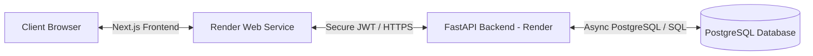

# 🎓 UniGrade — University Course & Grade Management System

A full-stack, enterprise-grade academic management system designed to streamline course catalogs, student enrollments, grading, and academic analytics. Built with a premium Neo-Brutalist design aesthetic, rigid role-based access control (RBAC), and a robust FastAPI + Next.js decoupled architecture.

---

## 🔗 Live Deployments

*   **Frontend App**: [https://university-grade-frontend.onrender.com](https://university-grade-frontend.onrender.com) (Deployed on Render Web Service)
*   **Backend API**: [https://university-course-grade-management.onrender.com](https://university-course-grade-management.onrender.com) (Deployed on Render Web Service)
*   **Database**: PostgreSQL (Hosted on Render Database)

---

## 🎨 Design System & Aesthetic (Neo-Brutalism)

UniGrade breaks away from generic, boring enterprise layouts by employing a high-end **Neo-Brutalist** aesthetic. 
*   **High Contrast Geometry**: Distinct card layers using thick black borders (`border-2 border-zinc-950`) and retro-modern hard shadows (`shadow-[4px_4px_0px_0px_rgba(24,24,27,1)]`).
*   **Vibrant Color Palettes**: Tailored HSL gradients combining emerald, violet, pink, and amber tones on top of sleek dark/light borders.
*   **Micro-Animations**: Powered by **Framer Motion** for smooth, playful transitions, spring-loaded buttons, card hover lift-offs, and dynamic sidebar slides.
*   **Typography**: Clean, modern typography using the **Inter** font family for maximum legibility.

---

## 🏗️ Architecture Overview

The project is structured as a decoupled monorepo containing a Python backend and a TypeScript/Next.js frontend:



---

## 🌟 Key Features

### Frontend (Next.js App)
*   **Student Portal**: Displays personal statistics (GPA, total credits, enrolled classes) inside interactive Neo-brutalist widgets. Student data is FERPA-compliant and segregated.
*   **Staff Portal**: A command center featuring student registry management, course creator tools, enrollment logs, and grade editing panels.
*   **Interactive Grade Editor**: Staff can dynamically edit student grades and view a complete historical audit trail for grade modifications.
*   **Dynamic Search & Filtering**: Instant client-side and backend search filters for courses by department, semester, and year.
*   **Robust Navigation**: Fully responsive Sidebar and Header system with custom active state indicators and contextual auth redirects.

### Backend (FastAPI API)
*   **Strict Validations**: Complete data validation using Pydantic schemas for request bodies and API response mapping.
*   **Async Operations**: Async database operations utilizing SQLAlchemy 2.0 and `asyncpg` for high concurrency.
*   **Role-Based Security**: Decoupled JWT flows for students and staff with custom dependency-based route permission gates.
*   **Audit Logging**: Automatic logging of grade modifications, recording the changing actor, old grade, new grade, and exact timestamps.
*   **Automatic CORS Regex**: Allows dynamic Vercel previews and Render environments to interact securely with the API.

---

## 🛠️ Tech Stack

| Layer | Technologies Used |
| :--- | :--- |
| **Frontend Core** | Next.js 15+ (App Router), React 19, TypeScript |
| **Styling & Motion** | Tailwind CSS v4, Framer Motion, Lucide Icons |
| **Backend Core** | FastAPI, Uvicorn |
| **Database ORM** | SQLAlchemy 2.0 (Async), `asyncpg` |
| **Database engine** | PostgreSQL (Production), SQLite (Local Dev) |
| **Authentication** | JWT (PyJWT), PBKDF2 Password Hashing |
| **Testing Suite** | Pytest, HTTPX |

---

## 📂 Directory Structure

```
University-Course-Grade-Management/
├── backend/                  # FastAPI Backend Source
│   ├── api/v1/               # HTTP Routers (Auth, Students, Courses, Enrollments)
│   ├── core/                 # Config, security, logging, exceptions
│   ├── db/                   # Async engine, session, declarative base
│   ├── models/               # SQLAlchemy ORM schemas
│   ├── repositories/         # Async database queries (Repository pattern)
│   ├── schemas/              # Pydantic request/response validation schemas
│   ├── services/             # Core business logic handlers
│   └── test/                 # Pytest Unit & Integration tests
├── frontend/                 # Next.js Frontend Source
│   ├── src/
│   │   ├── app/              # Next.js App Router (Layouts & Pages)
│   │   ├── components/       # Custom Neo-brutalist widgets, sidebar, buttons
│   │   └── lib/              # AuthContext, API client (api.ts), utils
│   ├── public/               # Static assets & SVG icons
│   ├── package.json          # Frontend dependencies & scripts
│   └── tsconfig.json         # TypeScript configuration
├── .gitignore                # Global gitignore configuration
├── requirements.txt          # Python dependencies
└── pytest.ini                # Pytest configuration
```

---

## 🚀 Local Development Setup

Clone the repository to get started:
```bash
git clone https://github.com/Nojan-Devkota/University-Course-Grade-Management.git
cd University-Course-Grade-Management
```

### 1. Backend Setup
1. Navigate to the root directory and set up a virtual environment:
   ```bash
   python -m venv .venv
   source .venv/bin/activate  # On Windows: .venv\Scripts\activate
   ```
2. Install dependencies:
   ```bash
   pip install -r requirements.txt
   ```
3. Create your `.env` file from the example template:
   ```bash
   cp .env.example .env  # On Windows: copy .env.example .env
   ```
4. Generate a secure `JWT_SECRET_KEY` inside `.env`:
   ```bash
   python -c "import secrets; print(secrets.token_hex(32))"
   ```
5. Run the FastAPI development server:
   ```bash
   cd backend
   python -m uvicorn main:app --reload --host 127.0.0.1 --port 8000
   ```
*   **API Docs**: Visit [http://127.0.0.1:8000/docs](http://127.0.0.1:8000/docs) for the interactive Swagger documentation.

---

### 2. Frontend Setup
1. Open a new terminal and navigate to the `frontend` directory:
   ```bash
   cd frontend
   ```
2. Install dependencies:
   ```bash
   npm install
   ```
3. Start the Next.js development server:
   ```bash
   npm run dev
   ```
*   **Web App**: Open [http://localhost:3000](http://localhost:3000) to view the application locally.

---

## 🔒 Security & Authorization Matrix

UniGrade implements strict role-based access control. Public endpoints are separated from student-only views, and staff-only administrative capabilities:

| API Action / Resource | Endpoint | Public | Student | Staff |
| :--- | :--- | :---: | :---: | :---: |
| Register Student | `POST /api/v1/students` | ✔ | — | — |
| Student Login | `POST /api/v1/auth/login` | ✔ | — | — |
| Staff Login | `POST /api/v1/auth/staff/login` | ✔ | — | — |
| Course Catalog List | `GET /api/v1/courses` | ✔ | ✔ | ✔ |
| View Student Profile | `GET /api/v1/students/{id}` | — | Self Only | ✔ |
| Create / Delete Course | `POST / DELETE /api/v1/courses` | — | — | ✔ |
| Enroll in a Course | `POST /api/v1/enrollments` | — | Self Only | ✔ |
| Edit Grades / Status | `PATCH /api/v1/enrollments/{id}/grade` | — | — | ✔ |
| View Grade Audit History | `GET /api/v1/enrollments/{id}/grade-history` | — | — | ✔ |

---

## 📋 Academic Business Rules

The following core guidelines are programmatically enforced at the database, service, and schema layers:
1.  **Unique Course Offerings**: Courses are unique based on `Code` + `Semester` + `Year`.
2.  **Semester Credit Cap**: Students are limited to a maximum of **20 credits** per semester to prevent academic overload.
3.  **Grade Constraint**: All grade averages must strictly fall within the standard **0.0 to 4.0 GPA** scale.
4.  **Grade Audit Trails**: Any modification of grades requires staff authentication and writes a persistent entry into the Grade Change Audit table mapping the actor's ID and changing history.

---

## 🧪 Testing Suite

Tests can be run directly from the root folder (make sure your virtual environment is active):

```bash
# Run all tests
pytest

# Run tests in verbose mode
pytest -v

# Run integration API tests only
pytest backend/test/integration/
```

Our tests are grouped into:
*   **Unit Tests** (`backend/test/unit/`): Schema-level structural checks.
*   **Integration Tests** (`backend/test/integration/`): End-to-end routing validation, authentication flows, and rule enforcement using an in-memory database configuration.

---

## 🌐 Production Deployment Configuration

### Render Backend (FastAPI + PostgreSQL)
1.  Create a **PostgreSQL Database** on Render.
2.  Create a **Web Service** pointing to your repository.
3.  Set the **Start Command** to: `cd backend && python -m uvicorn main:app --host 0.0.0.0 --port $PORT`.
4.  Configure the following Environment Variables in Render:
    *   `DATABASE_URL`: `postgresql+asyncpg://...` (Render's internal DB connection string starting with `postgresql+asyncpg://`)
    *   `JWT_SECRET_KEY`: *[Your Hex String]*
    *   `STAFF_USERNAME`: *[Admin Username]*
    *   `STAFF_PASSWORD`: *[Admin Password]*
    *   `SQL_ECHO`: `false`

### Render Frontend (Next.js App)
1.  Create a new **Web Service** on Render.
2.  Set **Root Directory** to `frontend`.
3.  Set **Build Command** to: `npm install && npm run build`.
4.  Set **Start Command** to: `npm start`.
5.  Configure the following Environment Variable in Render:
    *   `NEXT_PUBLIC_API_URL`: `https://university-course-grade-management.onrender.com` (Your live backend URL)

---

## 📄 License

This project is licensed under the MIT License. Feel free to use and modify it for academic or personal administration purposes.
